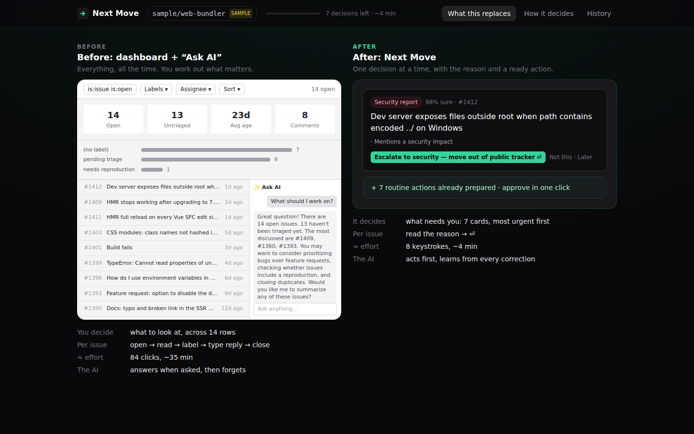
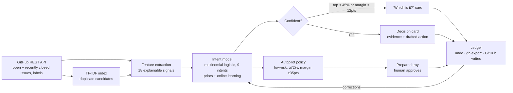

# Next Move

**Issue triage without a chatbot or a dashboard.** Next Move reads a GitHub repo's open issues, works out what each one needs (a reproduction? a duplicate? a regression? a security escalation?), and shows the maintainer **one decision at a time**, with the reason and an action ready to go. It also prepares the routine ones by itself and waits for approval.

> Built for the *Beyond the Chatbot* challenge. The workflow is open-source maintainer triage: a real, daily job that neither a chatbot nor a dashboard handles well.

**Live demo:** https://alijalil.github.io/beyond-the-chatbot/ (real issues from `vitejs/vite`; switch to any public repo from the header)



---

## The idea in 30 seconds

| | Dashboard + "Ask AI" | Next Move |
|---|---|---|
| Who decides what to look at | You, across every row | The interface, most urgent first |
| What you see | Every issue, every column, charts | One decision, its evidence, a ready action |
| Per issue | open → read → label → type reply → close | read the reason → <kbd>⏎</kbd> |
| AI's role | Answers when asked, then forgets | Acts first, asks when unsure, learns from each correction |

When you open the demo it has already read the tracker. It tells you how many routine actions it **prepared on its own**, how many need your judgement, and puts the most urgent card in front of you.

## Using it

- <kbd>⏎</kbd> **Do it**: apply the proposed action (labels, reply, close).
- <kbd>N</kbd> **Not this**: see the other ranked readings with their evidence, then pick one with <kbd>1</kbd>–<kbd>9</kbd>. The model learns from this right away.
- <kbd>S</kbd> **Later**: send the card to the back of the queue.
- <kbd>E</kbd> **Edit** the drafted reply before sending.
- **Prepared for you**: actions the interface set up on its own. Approve them one at a time or all at once. **Wrong — let me decide** moves one to your queue.
- **History**: every action with undo, plus an export as a `gh` CLI script.
- **What this replaces**: the dashboard + chatbot, built from the same data, next to Next Move.
- **How it decides**: the live pipeline with this session's numbers.

**Dry run by default.** Without a token nothing is sent to GitHub. You review, then export a `gh` script. If you maintain the repo, paste a token in the repo dialog (it stays in memory only) and actions are applied through the REST API. Undo works there too.

## Architecture: data → intent inference → surfaced decision → action



More detail in [docs/ARCHITECTURE.md](docs/ARCHITECTURE.md).

- **`src/engine/`**: framework-free TypeScript. It runs in the browser, in Node (CLI) and in tests.
  - `features.ts`: 18 named signals per issue (repro link, stack trace, version info, question phrasing, regression phrasing, similarity, staleness, traction, …). Each one keeps a quote from the issue.
  - `text.ts`: tokenizer, TF-IDF, cosine similarity, gist extraction.
  - `model.ts`: logistic model over the signals. It starts from priors and takes an SGD step on every human correction. Saved per repo.
  - `actions.ts`: turns an intent into labels, a reply and open/close, matched against **the repo's real label set**, including area labels like `feat: css`.
  - `infer.ts`: the pipeline, the abstain rule and priority.
  - `session.ts`: queue ordering, focus-mode detection, autopilot policy.
  - `ledger.ts` / `github.ts`: the audit trail, the `gh` script export, and REST reads and writes with undo.
- **`src/ui/`**: React + Tailwind. One card, one tray, no tables.
- **`src/cli/triage.ts`**: the same engine with no UI: `npm run triage -- vitejs/vite`.

## Failure test: what happens when it guesses wrong

See [docs/FAILURE_TEST.md](docs/FAILURE_TEST.md). In short:

1. **It asks instead of guessing** when the top two readings are close or the best one is weak.
2. **"Not this" is one key.** The alternatives are ranked and each shows its evidence.
3. **It learns straight away.** A toast says what changed ("Usage question: 41% → 78%") and which queued cards were re-read.
4. **Prepared actions are re-checked** after every lesson. If the system is now less sure, the action goes back to the human queue.
5. **Everything can be undone.** Undoing the latest action also rolls back what the model learned from it.

## Run it

```bash
npm install
npm run dev            # http://localhost:5173 (live GitHub data; ?sample=1 for offline sample)
npm test               # 23 engine tests (inference, learning, recovery, autopilot, export)
npm run triage -- vitejs/vite    # headless triage plan in the terminal
npm run snapshot -- vitejs/vite  # bake real issues into public/snapshot.json
npm run build
```

Deploys to GitHub Pages from `.github/workflows/deploy.yml`. The workflow runs tests, snapshots a real repo's issues (daily), and builds.

**Data sources, in order:** `?repo=owner/name` (live) → `public/snapshot.json` (real, built by CI) → live `vitejs/vite` → built-in synthetic sample (marked **SAMPLE** in the header).

## Honest scope

- The intent model is a transparent logistic model over hand-designed signals plus TF-IDF, not an LLM. That choice is on purpose: every guess can be explained, corrected with one key, and learned from right away. An LLM could draft replies later, but it shouldn't decide what gets surfaced.
- It reads the last ~200 open and ~100 recently closed issues. Duplicates of older issues outside that window are missed.
- The model learns per browser and per repo. There's no shared team model yet.
- Unauthenticated reads are limited to 60 requests/hour per visitor, which is why the build includes a snapshot.

## Docs

- [Architecture](docs/ARCHITECTURE.md)
- [Failure test](docs/FAILURE_TEST.md)
- [Two-year thesis](docs/THESIS.md)
- [90-second walkthrough script](docs/LOOM_SCRIPT.md)

MIT © Ali Jalil
