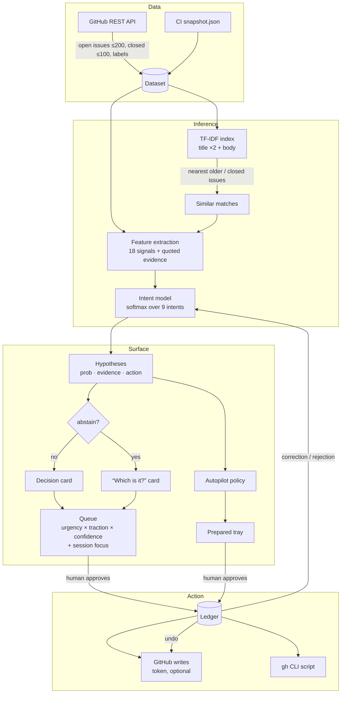

# Architecture snapshot

`data → intent inference → surfaced decision → action`, and corrections flow back into inference.



## 1. Data (`engine/github.ts`, `scripts/snapshot.ts`)

- Open issues (pull requests removed), recently closed issues (used as the duplicate corpus), and the repo's label set.
- Reads are unauthenticated and CORS-enabled, straight from the browser. CI saves a daily snapshot of a real repo so the demo still works when a visitor is rate-limited.

## 2. Intent inference (`engine/features.ts`, `text.ts`, `model.ts`, `infer.ts`)

**Signals** (each in [0,1] and each keeps a quote from the issue):

| Completeness | Phrasing | Context |
|---|---|---|
| reproduction link | usage question | similarity to an older/closed issue (TF-IDF cosine) |
| steps to reproduce | feature request | staleness (days idle) |
| code block | "worked in vX" (regression) | waiting-on-author label |
| stack trace / error | security impact | traction (reactions + comments) |
| version / env info | docs | maintainer author, already triaged |
| short body, unfilled template | | |

**Model.** A multinomial logistic model: `p(intent | x) = softmax(W·x)`. Completeness signals are centered (`x − 0.5`), so a *missing* repro link counts as evidence too. Other signals are raw, so a missing signal is neutral. `W` starts from maintainer priors (`PRIORS` in `model.ts`) and is updated online:

```
W[k] += lr · (y_k − p_k) · x          (cross-entropy SGD step, lr = 0.5)
```

- *Correction* ("Not this" → pick intent c): `y = one-hot(c)`.
- *Rejection* of a prepared action: `y` = the current distribution with the rejected intent zeroed out and the rest renormalized.
- *Approval*: a quiet reinforcing step toward the chosen intent.

Weights are saved per repo in `localStorage`. After each update every open card is re-scored and the UI says how many changed.

**Abstain rule.** If `top < 0.45` or `top − second < 0.12`, the card becomes a question with the two readings side by side, instead of a guess.

## 3. Surfaced decision (`engine/actions.ts`, `session.ts`, `ui/`)

- Each intent becomes a concrete, editable action. Labels are matched against the repo's real labels (`needs reproduction`, `feat: css`, …), with `pending triage` removed. Replies are drafted with the specifics of the issue: what is missing, or which issue it duplicates and which terms they share.
- **Priority** = `urgency(intent) × (0.55 + 0.45·traction) × confidence term`. Security is always first.
- **Session focus:** a streak of the same kind of approval ("clearing duplicates") pulls similar cards forward to keep the maintainer in flow.
- **Autopilot:** the interface prepares actions on its own only for low-risk intents (duplicate, needs-repro, docs, feature) at ≥72% confidence and ≥35 points clear of the next reading. Security, regressions, closing questions and closing stale issues are always left to a human. Prepared actions are re-checked after every lesson.

## 4. Action (`engine/ledger.ts`, `github.ts`)

- Nothing reaches GitHub except through the ledger. Each entry records who proposed the action (human or autopilot), what the model guessed first, and whether the human corrected it.
- **Dry run** (default): export a reviewed `gh` CLI script.
- **Live** (token in memory): labels, comment and close through REST. Undo reopens the issue, restores labels and deletes the posted comment.
